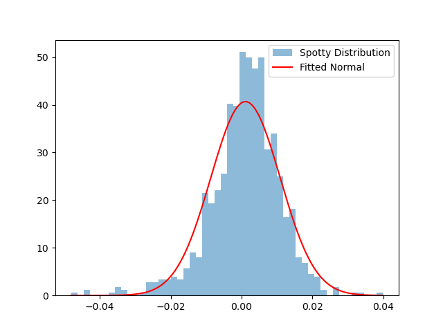
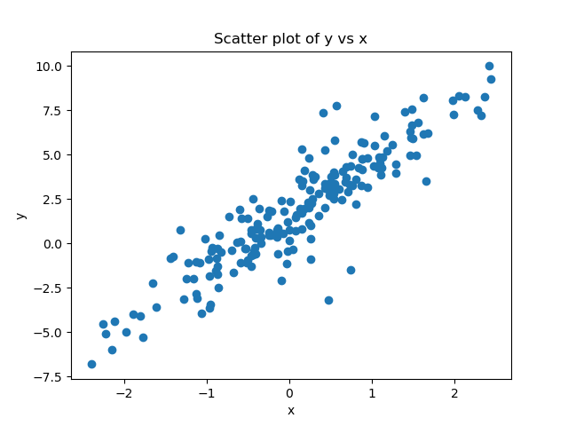
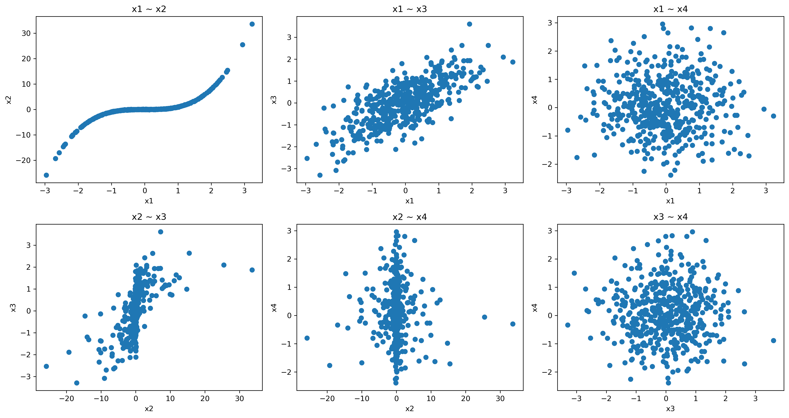
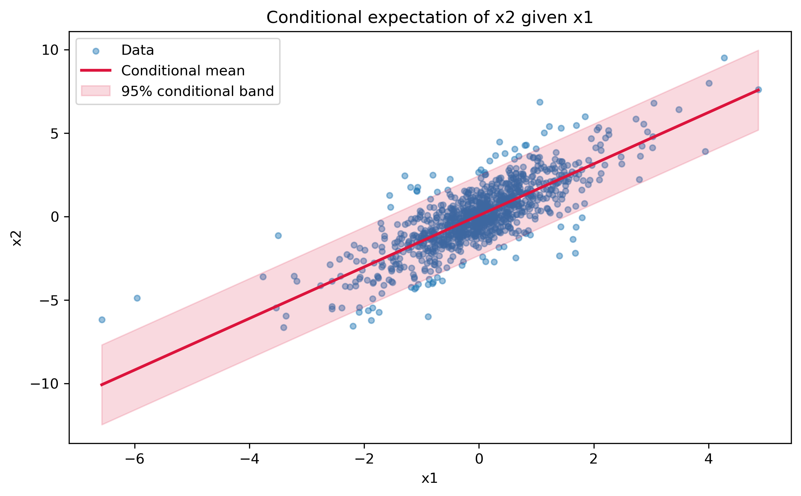
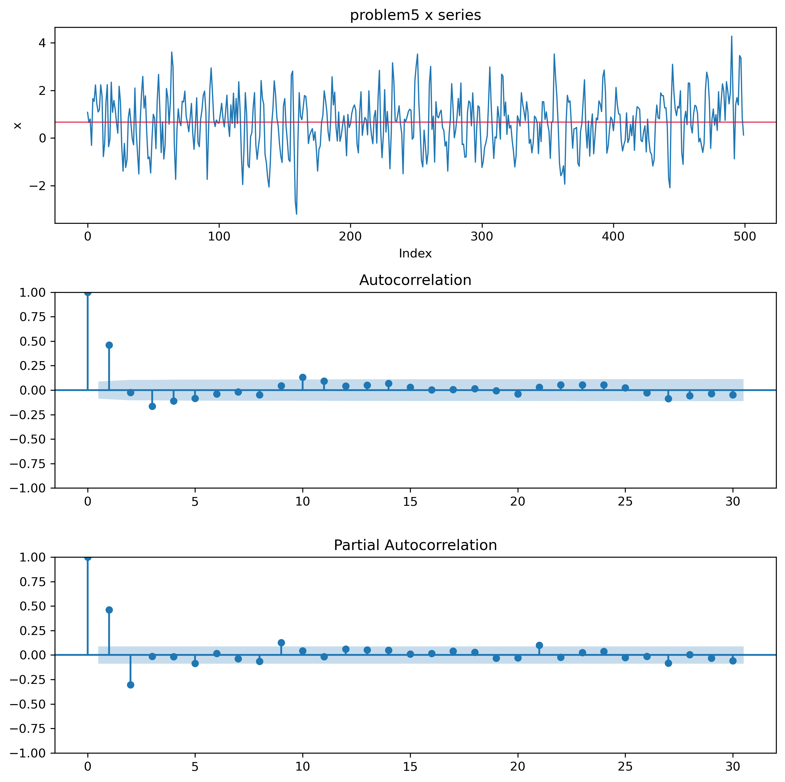

# Assignment1 Answer

## Question 1

### a

```
Mean: 0.0011043942883968638
Variance: 9.624822112193506e-05
Skewness: -0.6698366405653347
Kurtosis: 2.3576142339723893
```

With Skew < 0 and (Excess) Kurtosis > 0:

Seems to fit in NIG. NIG could have negative Skew and positive Excess Kurt. 

1. Can't be Normal Distribution since Skewness ≠ 0 and Excess Kurtosis ≠ 0
2. Can't be Student's T since Skewness ≠ 0
3. Can't be Lognormal since Skewness < 0

----

### b

```
Quantile at 0.01 - Actual: 26 Expected: 10.0
```

26 Observations fall below fitted Normal's 1% quantile, there should be 10.

----

### c



The fitted Normal fails in the tails, particularly the left tail. The sample is negatively skewed and has positive excess kurtosis, while the Normal is symmetric with zero excess kurtosis.

In particular, 26 observations fall below the fitted Normal's 1% quantile, compared with only 10 expected under the Normal model. That is to say, the fitted Normal substantially underestimates left-tail risk.

----

## Question 2

### Predict
#### a

The scatter shows a positive linear relationship between `x` and `y`. Most points are close to a straight line. However, several observations lie unusually far from the line.



There are 200 observations, and several points appear unusually far from the main linear pattern. This visually suggests more extreme residuals than I would expect under a Normal error distribution. Since, I expect the errors to be heavy-tailed, plausibly following a Student’s t distribution.

#### b 
The data appear to violate Assumption 7: the errors are not normally distributed and appear to be heavy-tailed. 

I expect the OLS slope to remain approximately unbiased if the other assumptions hold. However, the heavy-tailed errors may make the slope estimate more variable. So that, I expect the standard error of the slope to be larger and Normal-based inference to be less reliable. 

----

### Fit

### Model Estimates

| Model | $\alpha$ | $\alpha$ SE | $\beta$ | $\beta$ SE | Error Parameters |
|---|---:|---:|---:|---:|---|
| OLS | 1.560740 | 0.096269 | 2.990757 | 0.096640 | Residual standard error = 1.351401 |
| Normal MLE | 1.560740 | 0.095787 | 2.990757 | 0.096155 | $\sigma = 1.344627$ |
| Student's t MLE | 1.547979 | 0.080581 | 3.019179 | 0.078695 | Scale = 0.935509, $\nu = 3.632165$ |


| Model | AICc |
|---|---:|
| OLS | 692.145 |
| Normal MLE | 692.145 |
| Student's t MLE | 665.327 |

The Student's t model has the lowest AICc and is therefore preferred.

This provides strong evidence in favor of the Student's t error model. The improvement in fit from allowing heavy-tailed errors more than compensates for the additional degrees-of-freedom parameter.

---- 

### Reconcile

#### c. 

The three slope estimates are very close:

- OLS: $\hat{\beta} = 2.9908$
- Normal MLE: $\hat{\beta} = 2.9908$
- Student's t MLE: $\hat{\beta} = 3.0192$

The violation of normality did not move the estimated slope very much. The Student's t slope differs from the OLS slope by only about 0.0284, or roughly 0.95%.

Therefore, the main effect of the non-Normal errors is not a large change in the estimated linear relationship. The slope remains close to 3 across all three models.

#### d. 

The AICc values are:

| Model | AICc |
|---|---|
| OLS | 692.145 |
| Normal MLE | 692.145 |
| Student's t MLE | 665.327 |

The Student's t model is strongly preferred by AICc, even though the estimated slopes are very similar.

This suggests that the rejected Normal model is not mainly getting the slope wrong. Instead, it is getting the distribution of the regression errors wrong.

The fitted Student's t distribution has approximately 3.63 degrees of freedom, indicating substantially heavier tails than a Normal distribution. Therefore, the Normal model underestimates the probability of large residuals, while the Student's t model accommodates them much better.

#### e. 

The fitted error quantiles are approximately:

| Quantile | Normal Error | Student's t Error |
|---|---|---|
| 95% | 2.212 | 2.054 |
| 99.5% | 3.464 | 4.620 |

At the 95% quantile, the fitted Normal distribution is slightly wider than the fitted Student's t distribution. However, at the 99.5% quantile, the Student's t distribution is substantially wider.

This occurs because the Student's t model has a smaller fitted central scale but much heavier tails. Most observations are concentrated more tightly around zero, while extreme residuals are much more likely than under the Normal model.

For setting a capital buffer, I would prefer the Student's t model. Capital buffers are intended to protect against extreme losses, so the tail behavior is more important than the width of the central part of the distribution. At the 99.5% level, the Normal model materially underestimates the size of an extreme error.

----

## Question 3

### a.


I expect `x1` and `x2` to have the largest disagreement between Pearson and
Spearman correlations. Their relationship is strongly monotonic but clearly
nonlinear. Spearman correlation measures monotonic association using ranks,
whereas Pearson correlation measures linear association. Therefore, I expect
Spearman to report a stronger correlation for this pair.

For the pairs that show approximately linear relationships, I expect Pearson
and Spearman correlations to be relatively close. For pairs with little or no
apparent association, I also expect both measures to be close to zero.

----

### b.

The Pearson correlation matrix is:

| | x1 | x2 | x3 | x4 |
|---|---:|---:|---:|---:|
| x1 | 1.0000 | 0.7991 | 0.7195 | -0.0047 |
| x2 | 0.7991 | 1.0000 | 0.5876 | -0.0209 |
| x3 | 0.7195 | 0.5876 | 1.0000 | -0.0086 |
| x4 | -0.0047 | -0.0209 | -0.0086 | 1.0000 |

The Spearman correlation matrix is:

| | x1 | x2 | x3 | x4 |
|---|---:|---:|---:|---:|
| x1 | 1.0000 | 0.9719 | 0.6839 | 0.0002 |
| x2 | 0.9719 | 1.0000 | 0.6674 | -0.0011 |
| x3 | 0.6839 | 0.6674 | 1.0000 | -0.0024 |
| x4 | 0.0002 | -0.0011 | -0.0024 | 1.0000 |

```
x1 ~ x2: Pearson = 0.7991, Spearman = 0.9719, Gap = 0.1728
x1 ~ x3: Pearson = 0.7195, Spearman = 0.6839, Gap = 0.0356
x1 ~ x4: Pearson = -0.0047, Spearman = 0.0002, Gap = 0.0049
x2 ~ x3: Pearson = 0.5876, Spearman = 0.6674, Gap = 0.0798
x2 ~ x4: Pearson = -0.0209, Spearman = -0.0011, Gap = 0.0198
x3 ~ x4: Pearson = -0.0086, Spearman = -0.0024, Gap = 0.0062
```

As reported, x1, x2 has the largest gap (0.1728)

---- 

### c.

The large gap between `x1` and `x2` is caused by their strongly monotonic but nonlinear relationship. The scatter plot shows a clear S-shaped pattern.

Spearman correlation is based on ranks. Since `x2` almost always increases as `x1` increases, their rankings are highly consistent, resulting in a very high Spearman correlation of 0.9719.

Pearson correlation measures linear association. Because the relationship is nonlinear, a straight line does not describe the relationship as well, resulting in the lower Pearson correlation of 0.7991.

For this pair, Spearman is the more honest description if the question is how strongly the two variables move together monotonically. Pearson is answering a different question: how strongly are `x1` and `x2` linearly related?

----

## Question 4

### a.

The sample covariance matrix is


$$
\Sigma =
\begin{bmatrix}
1.099875 & 1.696902 \\
1.696902 & 4.104749
\end{bmatrix}.
$$

For the conditional distribution of $x_2$ given $x_1$,

Here $x_1$ is block 1 and $x_2$ is block 2, so
$\Sigma_{11}=\mathrm{Var}(x_1)$, $\Sigma_{22}=\mathrm{Var}(x_2)$, and
$\Sigma_{12}=\Sigma_{21}=\mathrm{Cov}(x_1,x_2)$.

$$
\mathrm{Var}(x_2 \,|\, x_1)
=
\Sigma_{22}
-
\Sigma_{21}\Sigma_{11}^{-1}\Sigma_{12}.
$$

Thus,

$$
\mathrm{Var}(x_2 \,|\, x_1)
=
4.104749
-
\frac{1.696902^2}{1.099875}
=
1.486746.
$$

The remaining variance factor is

$$
\frac{\mathrm{Var}(x_2 \,|\, x_1)}
{\mathrm{Var}(x_2)}
=
\frac{1.486746}{4.104749}
=
0.3622.
$$

Therefore, after observing $x_1$, the uncertainty in $x_2$ falls to about
36.22% of its original variance, corresponding to a reduction of about 63.78%.

----

### b.

Under the multivariate Normal, that factor does not depend on the value of
$x_1$ that was observed.

The term that settles this is the conditional variance:

$$
\mathrm{Var}(x_2 \,|\, x_1)
=
\Sigma_{22}
-
\Sigma_{21}\Sigma_{11}^{-1}\Sigma_{12}.
$$

There is no observed value of $x_1$ in this expression. The observed value of
$x_1$ changes the conditional mean, but not the conditional variance. Therefore
the 95% band has constant width under the multivariate Normal assumption.

----

### c.

The conditional mean is

$$
\mathrm{E}[x_2 \,|\, x_1]
=
\mu_2
+
\Sigma_{21}\Sigma_{11}^{-1}(x_1 - \mu_1).
$$

For this data,

$$
\mu_1=-0.016714,\quad
\mu_2=0.045288,\quad
\Sigma_{21}\Sigma_{11}^{-1}
=
\frac{1.696902}{1.099875}
=
1.542813.
$$

So the fitted conditional expectation is

$$
\mathrm{E}[x_2 \,|\, x_1]
=
0.045288 + 1.542813(x_1 + 0.016714)
=
0.071073 + 1.542813x_1.
$$

The coefficient on $x_1$ is 1.542813. In regression terms, it is the slope from
regressing $x_2$ on $x_1$.

The conditional standard deviation is

$$
\sqrt{1.486746}=1.219322,
$$

so the 95% Normal conditional band is

$$
\mathrm{E}[x_2 \,|\, x_1] \pm 1.96(1.219322)
=
\mathrm{E}[x_2 \,|\, x_1] \pm 2.389827.
$$



----

### d.

The fraction of observations inside the 95% conditional band is:

$$
\frac{935}{1000}=0.935.
$$

So the observed coverage is 93.5%, slightly below the nominal 95%.

----

### e.

Splitting the sample by the distance of $x_1$ from its mean gives:

| Bucket for $x_1$ | Observations | Inside Band | Coverage |
|---|---:|---:|---:|
| Within 1 standard deviation | 759 | 726 | 95.65% |
| Between 1 and 2 standard deviations | 190 | 163 | 85.79% |
| Beyond 2 standard deviations | 51 | 46 | 90.20% |

----

### f.

The coverage is not flat. It is close to 95% near the center of the $x_1$
distribution, but it falls noticeably for observations between one and two
standard deviations from the mean.

This tells me that the constant-width conditional band is not describing the
data equally well across the range of $x_1$. The assumption that fails is the
multivariate Normal implication of constant conditional variance:

$$
\mathrm{Var}(x_2 \,|\, x_1)
=
\Sigma_{22}
-
\Sigma_{21}\Sigma_{11}^{-1}\Sigma_{12}.
$$

The conditional mean from part (c) can still be useful as the best linear
conditional expectation, and the slope still has the regression interpretation
for the linear relationship between $x_1$ and $x_2$. What does not survive is
the constant-width 95% band as a reliable description of conditional uncertainty
at every value of $x_1$.

----

## Question 5

### Predict



### a.

The ACF decays rather than cutting off immediately. The PACF has large
significant spikes at lags 1 and 2, and then mostly falls inside the
significance band.

This pattern suggests an AR process rather than an MA process. My prediction
before fitting is AR(2).

### b.

The rule I used is:

- For an AR($p$) process, the PACF cuts off after lag $p$, while the ACF decays.
- For an MA($q$) process, the ACF cuts off after lag $q$, while the PACF decays.

With $n=500$, the approximate 95% significance band is

$$
\pm \frac{1.96}{\sqrt{500}} = \pm 0.0877.
$$

The first two PACF values are about 0.4616 and -0.3031, both well outside the
band. The lag 3 PACF is about -0.0147, inside the band. That is why I interpret
the PACF as cutting off after lag 2.

### Fit and Reconcile

### c.

| Model | AICc |
|---|---:|
| AR(1) | 1418.587 |
| AR(2) | 1372.438 |
| AR(3) | 1374.343 |
| MA(1) | 1389.084 |
| MA(2) | 1381.232 |
| MA(3) | 1374.117 |

### d.

AICc selects AR(2), which matches the prediction from the ACF/PACF plot.

### e.

The AR(2) and AR(3) fitted coefficients are:

| Model | Coefficients |
|---|---|
| AR(2) | $\phi_1=0.6012,\ \phi_2=-0.3026$ |
| AR(3) | $\phi_1=0.5962,\ \phi_2=-0.2927,\ \phi_3=-0.0165$ |

The third AR coefficient is very small. AR(3) improves the likelihood only
slightly, but it adds an extra estimated parameter. AICc trades off fit against
model complexity, with an extra small-sample penalty. Here, the tiny improvement
from $\phi_3$ is not worth the added parameter, so AICc rejects AR(3) in favor
of AR(2).

$R^2$ would not make the same choice because it does not penalize additional
parameters in the same way. Adding another lag can only maintain or improve
in-sample fit, so an $R^2$-based rule would be more likely to prefer the larger
model even when the extra coefficient has little predictive value.
