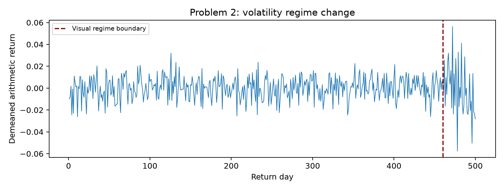
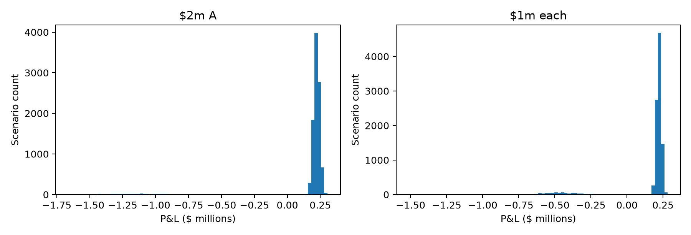
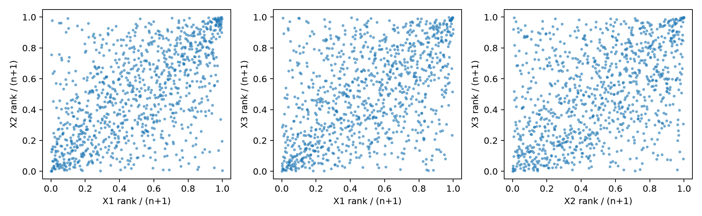

# Assignment 2: Covariance, VaR, and Copulas

**Haolun Wu | FinTech 545 | October 5, 2026**

This response answers all five problems in the supplied Assignment 2 PDF. Each
problem separates the prediction, model estimates, and reconciliation. Predictions
were recorded in `Codes/predictions.md` after examining the permitted descriptive
evidence and before calculating model fits or risk measures.

**Conventions.** Arithmetic returns use the supplied row order. Variance and
standard deviation use $n-1$ unless stated otherwise. The first four moments are
mean, sample variance, empirical skewness, and empirical **excess** kurtosis
(ordinary kurtosis equals excess kurtosis plus 3). Positions are dollar investment
values. A loss has a positive sign:

$$\operatorname{VaR}_\alpha=-q_\alpha(\mathrm{P\&L}),\qquad
\operatorname{ES}_\alpha=-\text{mean of the worst }\alpha\text{ fraction of P\&L}.$$

Historical VaR uses NumPy's linear quantile. ES averages exactly the worst
$\alpha n$ observations, including fractional boundary mass if needed. **A negative
VaR represents a gain at the quantile**, rather than a negative loss; these values
are retained and explicitly interpreted in Problem 3. Flooring them at zero would
change the requested mathematical subadditivity check. Simulations use 100,000
scenarios, fixed seeds, and common normal draws when comparing assumptions.

## 1. Correlations from mismatched histories

### Predict: joint observations and parts (a)-(c)

The table counts each pair's jointly observed days; diagonal entries are each
series's available history. All five series trade together on **81
days**.

| Series | A | B | C | D | IDX |
| --- | --- | --- | --- | --- | --- |
| A | 242 | 242 | 221 | 93 | 242 |
| B | 242 | 242 | 221 | 93 | 242 |
| C | 221 | 221 | 228 | 83 | 228 |
| D | 93 | 93 | 83 | 96 | 96 |
| IDX | 242 | 242 | 228 | 96 | 250 |

**(a)** Complete-case correlation is guaranteed PSD when computed on the same
nonconstant columns and complete rows: it is a scaled Gram matrix. For a centered,
standardized data matrix $Z$, $R=Z^TZ/(n-1)$ and
$v^TRv=\|Zv\|^2/(n-1)\geq0$ for every vector $v$. PSD does not by itself
guarantee that ordinary Cholesky succeeds, because a singular matrix is PSD but
not positive definite. Pairwise correlation can be indefinite. Every pair uses
its own subset and means, so the assembled entries need not correspond to any
single Gram matrix, even though each entry is individually a valid correlation.

**(b)** If IDX were exactly the weighted basket, the five-dimensional covariance
and correlation matrices would have a zero eigenvalue. Small tracking error makes
the true smallest eigenvalue small and positive rather than comfortably far from
zero. This sample is therefore particularly exposed to estimation inconsistencies:
small entry changes can push that near-zero eigenvalue below zero.

**(c)** I expect D-related correlations to be least reliable because D has only
96 observations. C-D is the weakest by sample count, at 83 joint days; A-D and B-D
have 93 each. The complete-case estimator uses just 81 days even for pairs whose
full shared histories are much longer. Counts indicate precision but do not prove
that the overlapping periods represent the same underlying regime.

### Fit: parts (d)-(f)

**(d)** The complete-case correlation matrix is:

| Series | A | B | C | D | IDX |
| --- | --- | --- | --- | --- | --- |
| A | 1.000000 | 0.396728 | 0.246622 | 0.413553 | 0.871358 |
| B | 0.396728 | 1.000000 | 0.316887 | 0.236053 | 0.670860 |
| C | 0.246622 | 0.316887 | 1.000000 | 0.185180 | 0.564842 |
| D | 0.413553 | 0.236053 | 0.185180 | 1.000000 | 0.571930 |
| IDX | 0.871358 | 0.670860 | 0.564842 | 0.571930 | 1.000000 |

Its eigenvalues in ascending order are:

`0.001505787, 0.548345279, 0.693319552, 0.870441029, 2.886388352`.

The pairwise correlation matrix is:

| Series | A | B | C | D | IDX |
| --- | --- | --- | --- | --- | --- |
| A | 1.000000 | 0.468626 | 0.430888 | 0.438449 | 0.869584 |
| B | 0.468626 | 1.000000 | 0.463023 | 0.276692 | 0.732867 |
| C | 0.430888 | 0.463023 | 1.000000 | 0.184615 | 0.713575 |
| D | 0.438449 | 0.276692 | 0.184615 | 1.000000 | 0.605691 |
| IDX | 0.869584 | 0.732867 | 0.713575 | 0.605691 | 1.000000 |

Its eigenvalues in ascending order are:

`-0.011071847, 0.471421960, 0.528366787, 0.857381135, 3.153901965`.

Ordinary `numpy.linalg.cholesky` succeeds for complete-case correlation and fails
for pairwise correlation. The negative pairwise eigenvalue is materially below
floating-point error, so the failure is substantive.

**(e)** I construct $\Sigma=D_sR_{pair}D_s$ with $D_s$ holding each series's
full-history sample standard deviation. These are:

| Series | Std |
| --- | --- |
| A | 0.01650183 |
| B | 0.01191893 |
| C | 0.01832355 |
| D | 0.02282866 |
| IDX | 0.01228141 |

The tracking portfolio has weights $w=(-0.40,-0.30,-0.20,-0.10,1)^T$ in the order
A, B, C, D, IDX. Its variance $w^T\Sigma w$ is
**-1.799369655e-06**, in squared return units.

**(f)** Rebonato-Jackel clips negative correlation eigenvalues to zero and rescales
the diagonal to one. Higham alternates projections onto the PSD cone and unit
diagonal with Dykstra's correction. The repository implements both. I use Higham
tolerance $10^{-12}$, retain full-history standard deviations, and recompute
the same tracking variance.

| Method | Smallest eigenvalue | Frobenius distance | Tracking variance |
| --- | --- | --- | --- |
| Complete case | 0.001506 | 0.423935 | 1.097545e-06 |
| Pairwise | -0.011072 | 0 | -1.799370e-06 |
| Rebonato-Jackel | -7.515355e-17 | 0.016182 | 6.807298e-07 |
| Higham | -8.604428e-13 | 0.015520 | 6.787649e-07 |

The repaired eigenvalues near zero are numerical zeros; Higham's tiny negative
value is within its stated tolerance. Both repairs restore a nonnegative tracking
variance. A repaired correlation can be singular, so ordinary Cholesky need not
succeed for it; PSD simulation requires a factorization that permits zero pivots.
The complete-case row in this table also uses the full-history standard deviations
to isolate the change in correlation estimator.

### Reconcile: parts (g)-(i)

**(g)** PSD means $w^T\Sigma w\geq0$ for **every** portfolio vector $w$.
The negative variance in (e) directly violates this definition. It is not evidence
that this hedge is safer than zero risk: it demonstrates that the matrix is not a
valid covariance matrix. Congruence with positive $D_s$ preserves the failure of
PSD, and this particular near-basket direction exposes it.

**(h)** Higham's largest three entry changes are shown first below. Symmetric
entries have equal changes and are counted once.

| Pair | Overlap | Pairwise | Higham | Change |
| --- | --- | --- | --- | --- |
| A-IDX | 242.000000 | 0.869584 | 0.862540 | -0.007045 |
| C-IDX | 228.000000 | 0.713575 | 0.708810 | -0.004765 |
| B-IDX | 242.000000 | 0.732867 | 0.728687 | -0.004180 |
| D-IDX | 96.000000 | 0.605691 | 0.601964 | -0.003727 |
| A-C | 221.000000 | 0.430888 | 0.433165 | 0.002277 |
| A-B | 242.000000 | 0.468626 | 0.470623 | 0.001997 |
| A-D | 93.000000 | 0.438449 | 0.440230 | 0.001781 |
| B-C | 221.000000 | 0.463023 | 0.464374 | 0.001351 |
| C-D | 83.000000 | 0.184615 | 0.185820 | 0.001205 |
| B-D | 93.000000 | 0.276692 | 0.277749 | 0.001057 |

The largest movements involve IDX, especially A-IDX, rather than the least observed
C-D pair. That differs from my reliability ranking but is expected from the
algorithm's objective. Unweighted Higham minimizes Frobenius distance subject to
PSD and a unit diagonal; it uses the geometry of the inconsistent eigenstructure,
not observation counts or entry-specific estimation uncertainty. The near-linear
index relationship drives the constraint violation. A reliability-weighted repair
would pose a different optimization problem.

**(i)** The complete-case/pairwise gap is
**0.423935** in Frobenius norm, compared with
**0.016182** for Rebonato-Jackel and
**0.015520** for Higham. The two repairs
differ by only **0.004579**. Here the estimator choice changes the
matrix much more than either the repair's magnitude or the choice between repairs.
Repair is still necessary to make the pairwise matrix admissible; numerical
admissibility alone does not settle which sampling estimator is more reliable.

## 2. A volatility estimate after the regime changed

### Predict: parts (a)-(c)

I compute 500 arithmetic returns from the 501 prices and remove their full-sample
mean, **0.000161876**. The plot suggests a change near day 461, so I
identify the most recent 40 returns as a visibly higher-volatility period. This
is a visual split, not an estimated or assumed known change point.

**(a)** My recorded smallest-to-largest prediction was:

**fitted t < historical < equal-weight normal < EW normal 0.97 < EW normal 0.94.**

The recent high-volatility days should dominate EW estimates, especially with
0.94. A full-sample normal standard deviation is inflated by the volatile period.
I expected a t fit to emphasize the quieter center while allowing large shocks;
the historical-versus-t-versus-normal ordering was less certain because the 5%
quantile depends on observed lower-tail frequency, not kurtosis alone.

**(b)** For normalized weights $w_j\propto\lambda^j$, with age $j=0$ for the
newest return, the finite-sample effective sample size is
$n_{eff}=1/\sum w_j^2$. Its infinite-history limit is
$(1+\lambda)/(1-\lambda)$. Half life is $\log(0.5)/\log\lambda$.
The last $m=40$ days receive $(1-\lambda^m)/(1-\lambda^{500})$ of total weight.

| Lambda | Effective sample | Half life | Recent 40 weight |
| --- | --- | --- | --- |
| 0.970000 | 65.666635 | 22.756573 | 0.704288 |
| 0.940000 | 32.333333 | 11.202306 | 0.915838 |

Thus 0.94 places about 92% of its weight on the visible new period, whereas 0.97
places about 70% there. They are estimating different mixtures of old and new
volatility, not simply applying two equally precise estimates to the same regime.

**(c)** The full-sample moments are:

| Series | Mean | Variance | Skewness | Excess kurtosis |
| --- | --- | --- | --- | --- |
| Return | -2.220446e-19 | 1.418981e-04 | -0.155587 | 2.132367 |

Excess kurtosis **2.132367** is large relative to the
normal benchmark of zero, while skewness is modest. A rough normal sampling
standard error for excess kurtosis is $\sqrt{24/500}\approx0.219$; this is
a descriptive benchmark, not a definitive test for these potentially nonstationary
returns. The plot and moments make a single constant-volatility normal regime
implausible as a useful description. A mixture of normal regimes can produce
heavy unconditional tails without heavy tails within each regime.

### Fit: part (d)

All VaRs below are one-day dollar values for a USD 1,000,000 position, at 5%.
Normal estimates use zero mean after full-sample demeaning. EW variance follows
the existing library convention: a weighted local mean and normalized weights,
without an extra $n-1$ correction. A constant shift of the series leaves that
weighted variance unchanged.

| Method | VaR |
| --- | --- |
| Equal-weight normal | 19,593.66 |
| EW normal 0.97 | 34,063.74 |
| EW normal 0.94 | 36,307.95 |
| Fitted t | 18,872.44 |
| Historical | 20,514.50 |

The fitted t parameters are location **0.000181639**, scale
**0.010289990**, and degrees of freedom
**8.269918**. Its scale is not its standard deviation. Although the
sample was demeaned, an unrestricted t likelihood can have a nonzero fitted
location; I retain it when computing $-\mu-s\,t_\nu^{-1}(0.05)$.

### Reconcile: parts (e)-(g)

**(e)** The actual ranking is:

**Fitted t < Equal-weight normal < Historical < EW normal 0.97 < EW normal 0.94.**

My recent-weighted and t predictions were supported, but historical and equal-weight
normal reversed. I had treated overall variance inflation as a sufficient guide
to the empirical 5% quantile. The lower-tail observations put that quantile farther
out than the normal's 1.645-standard-deviation threshold. Heavy unconditional tails
do not force every quantile to exceed the normal value: the fitted t has a smaller
central scale and the lowest 5% VaR in this sample.

**(f)** Using the same visually selected boundary:

| Regime | Days | Mean | Std |
| --- | --- | --- | --- |
| Days 1-460 | 460.000000 | 0.000209 | 0.010178 |
| Days 461-500 | 40.000000 | -0.002406 | 0.024289 |

The newer period has roughly 2.4 times the older standard deviation. For a
zero-mean mixture of normal regimes, $\kappa_{excess}=
3E[\sigma^4]/E[\sigma^2]^2-3$. Inserting the regime sample variances and
fractions 460/500 and 40/500 gives **2.572275**,
the same order as the observed excess kurtosis. This illustration neglects the
small regime mean differences and finite-sample fourth-moment error. It explains
why pooled returns can look t-like: the fitted t describes an **unconditional
variance mixture**, rather than proving that tomorrow's shocks follow one stable
t law. This observation alone does not establish normality within each regime.

**(g)** Applying the supplied approximation
$\operatorname{SE}(\hat\sigma)\approx\hat\sigma/\sqrt{2n_{eff}}$:

| Lambda | Sigma | Sigma SE | VaR SE |
| --- | --- | --- | --- |
| 0.970000 | 0.020709 | 0.001807 | 2972.384575 |
| 0.940000 | 0.022074 | 0.002745 | 4515.039136 |

The EW VaR gap is **USD 2,244.21**, smaller than either individual approximate
VaR standard error. It is therefore not clearly larger than the stated estimation
noise benchmark. The two estimates use the same observations and are correlated;
their individual standard errors do not provide the standard error of their
difference, and adding them as if independent would not be a formal test. The
normal-regime approximation is also imperfect during a volatility transition.

**Opinion:** I would use 0.94 for a trading limit because it reacts faster to
current market risk, while monitoring the instability caused by its effective
sample of only about 32 days. I would prefer 0.97 among these two for a capital
number because its longer memory is more stable. Capital also needs stress
scenarios and a specified horizon; the slower decay factor alone does not make
this one-day estimate an adequate capital methodology.

## 3. When diversification raises VaR

### Predict: parts (a)-(b)

The two histograms contain a large repayment cluster and a small default-loss
cluster. Splitting the investment usually reduces the loss when only one bond
defaults, but it creates more scenarios with some loss.

**(a)** Bond-return moments are:

| Series | Mean | Variance | Skewness | Excess kurtosis |
| --- | --- | --- | --- | --- |
| A | 0.083709 | 0.018493 | -4.822523 | 22.081997 |
| B | 0.085011 | 0.017451 | -4.914778 | 23.074367 |

Both bonds are strongly negatively skewed and have excess kurtosis above 22.
A symmetric normal approximation spreads mass smoothly between the repayment
and default outcomes, whereas these scenarios have separated clusters. Mean and
variance therefore cannot locate the default threshold adequately. A normal VaR
can miss both the sign of the individual 5% quantile and the portfolio's change
in default probability.

**(b)** Losses exceeding 20% occur in **406 A scenarios (4.06%)**,
**393 B scenarios (3.93%)**, and
**782 union scenarios (7.82%)**. Both default in
**17 scenarios (0.17%)**. My prediction was that diversification
raises 5% VaR but lowers ES relative to investing all USD 2m in A. For concentrated
A, the 5th percentile lies beyond its default cluster in the repayment outcomes.
For the diversified choice, 7.82% of scenarios have at least one default, so its
5th percentile falls within a loss cluster. ES should improve because most of
these defaults affect only half the investment. Counts alone do not determine
ES; the severity pattern visible in the P&L plots supports that prediction.

### Fit: parts (c)-(e)

**(c)** Historical 5% risk, in dollars:

| Position | VaR 5% | ES 5% |
| --- | --- | --- |
| USD 1m A | -84,569.80 | 443,628.30 |
| USD 1m B | -86,063.46 | 419,587.29 |
| USD 2m A | -169,139.60 | 887,256.60 |
| USD 1m each | 414,604.15 | 541,997.24 |

For the individual positions and concentrated A, the negative 5% VaR is a
**positive gain at the lower quantile**. For example, the USD 2m A position's 5th
percentile is a gain of USD 169,139.60.
Its ES is nevertheless a large positive loss because ES includes all the
severe defaults in the worst 5%. Negative VaR does not mean defaults are absent.

**(d)** Normal 5% VaR, using each position's sample P&L mean and standard deviation:

| Position | Normal VaR 5% |
| --- | --- |
| USD 1m A | 139,970.62 |
| USD 1m B | 132,276.77 |
| USD 2m A | 279,941.24 |
| USD 1m each | 143,466.25 |

Here $\operatorname{VaR}=-\bar P+1.644854\,s_P$. I retain the positive
expected bond repayment in $\bar P$ rather than incorrectly imposing zero mean.

**(e)** Historical 1% risk, in dollars:

| Position | VaR 1% | ES 1% |
| --- | --- | --- |
| USD 1m A | 649,701.27 | 709,547.78 |
| USD 1m B | 640,392.63 | 700,805.34 |
| USD 2m A | 1,299,402.55 | 1,419,095.55 |
| USD 1m each | 598,122.57 | 716,407.69 |

### Reconcile: parts (f)-(h)

**(f)** For the two USD 1m positions, 5% VaR subadditivity would require
$\operatorname{VaR}(A+B)\leq\operatorname{VaR}(A)+\operatorname{VaR}(B)$.
Numerically the left side is **USD 414,604.15**
and the right side is **USD -170,633.26**. The inequality fails. Individual
5% quantiles hide defaults whose probabilities sit below 5%; the union pushes the
combined position's loss probability above that cutoff. This is a quantile
threshold effect, not a claim that diversification increases every notion of risk.

ES satisfies the same check: the combined ES is
**USD 541,997.24**, below the sum
**USD 863,215.59**. It is also below the concentrated USD 2m A ES of
**USD 887,256.60**. Averaging the entire tail
captures loss severity and rewards spreading most defaults over half the capital.
Both parts of my prediction are supported.

**(g)** Normal VaR favors USD 1m in each: its value is
USD 143,466.25 versus
USD 279,941.24 for USD 2m A. This is reasonable
if the economic criterion is lower severe-loss exposure, as ES also favors the
split. It is **not correct for the requested historical 5% VaR ranking**.
The normal reaches its conclusion through lower variance and a smooth symmetric
distribution, which does not describe the probability mass crossing the 5%
threshold. Thus it does not identify the actual mechanism in these scenarios.

**(h)** At 1%, each individual VaR is inside the default-loss cluster. The
diversified VaR is now smaller than concentrated A's VaR, and the subadditivity
inequality holds for this data: the combined value is
USD 598,122.57, compared with the sum
USD 1,290,093.90.
The 0.17% simultaneous-default frequency is below 1%; most of the worst 1% still
consists of single defaults. VaR's failure depends on the probability level and
the shape and placement of probability mass. Its success at 1% here is not a
general proof of coherence.

## 4. Gaussian or t copula

### Predict: parts (a)-(b)

**(a)** The return moments are:

| Series | Mean | Variance | Skewness | Excess kurtosis |
| --- | --- | --- | --- | --- |
| X1 | 2.565850e-04 | 1.414697e-04 | -0.034174 | -0.122542 |
| X2 | -2.523809e-04 | 2.614199e-04 | -0.614117 | 7.083388 |
| X3 | 8.897999e-04 | 1.003768e-04 | 0.073955 | 2.853745 |

I predict a normal margin for X1 and t margins for X2 and X3. X1 is nearly
symmetric with near-zero excess kurtosis. X2 and X3 look heavier-tailed. X2's
skewness and particularly its excess kurtosis deserve a sensitivity check.
Removing each series's largest absolute deviation from its mean gives:

| Series | Row | Value | Skew without | Excess without |
| --- | --- | --- | --- | --- |
| X1 | 952.000000 | -0.040000 | -0.005487 | -0.192699 |
| X2 | 952.000000 | -0.142914 | 0.055783 | 1.710093 |
| X3 | 952.000000 | -0.061244 | 0.312681 | 1.716058 |

All three extreme observations occur on row 952. In X2, removing that row changes
skewness from about -0.614 to +0.056 and excess kurtosis from about 7.083 to 1.710.
It strongly influences the moments, but substantial excess kurtosis remains.
A symmetric t accommodates thickness, not genuine asymmetry; one influential
observation alone is weak evidence for a stable skewed distribution. I keep the
observation in all fits and risk calculations.

**(b)** I use ranks divided by $n+1$, so every pseudo-observation lies strictly
inside $(0,1)$. The rank plots show clusters in joint corners, as well as positive
association through the center.

The counts of days jointly in the worst or best 2.5% are:

| Pair | Lower | Upper |
| --- | --- | --- |
| X1-X2 | 6 | 8 |
| X1-X3 | 7 | 12 |
| X2-X3 | 6 | 9 |

Under independent series the expected count on **each side** is
$1000(0.025)^2=0.625$ days. Actual counts of 6-12 are much higher. My prediction
is that the t copula wins because it can model stronger simultaneous extreme
ranks. Independence is only a baseline: positive Gaussian dependence itself also
raises joint-tail counts, so exceeding 0.625 is not sufficient to distinguish
Gaussian and t copulas. The visual corner concentration motivates the comparison
but the fits must decide whether additional tail dependence is justified.

### Fit: parts (c)-(f)

**(c)** Normal and t fits use maximum likelihood. The repository's normal fit
returns the sample standard deviation; I multiply it by $\sqrt{(n-1)/n}$ to
obtain the normal MLE standard deviation before scoring. The t scale comes
directly from the repository's MLE fit. AICc is

$$\mathrm{AICc}=2k-2\ell+\frac{2k(k+1)}{n-k-1}.$$

Here normal has $k=2$ and t has $k=3$. Smaller scores are preferred.

| Margin | Model | Mu | Scale | Nu | Log L | AICc |
| --- | --- | --- | --- | --- | --- | --- |
| X1 | Normal | 2.565850e-04 | 0.011888 | - | 3013.274274 | -6022.536513 |
| X1 | t | 2.565563e-04 | 0.011888 | 9.884359e+08 | 3013.274274 | -6020.524452 |
| X2 | Normal | -2.523809e-04 | 0.016160 | - | 2706.253036 | -5408.494036 |
| X2 | t | -1.759779e-04 | 0.012544 | 5.271506 | 2762.104428 | -5518.184759 |
| X3 | Normal | 8.897999e-04 | 0.010014 | - | 3184.851638 | -6365.691239 |
| X3 | t | 7.455853e-04 | 0.008181 | 6.094916 | 3217.019807 | -6428.015517 |

AICc selects **normal for X1, t for X2, and t for X3**, agreeing with my prediction.
X1's enormous fitted t degrees of freedom is the normal limit, not convincing
evidence for a distinct finite-t tail. Its log likelihood is essentially the
normal likelihood and its additional parameter incurs a penalty. AICc is used
as the requested comparison; near this boundary its usual regular-model
interpretation deserves caution. X2 and X3 show clear finite-t improvements.

**(d)** I transform returns through each selected fitted marginal CDF. For each
pair I estimate Kendall's $\tau$ from the returns and set
$R_{ij}=\sin(\pi\tau_{ij}/2)$. The resulting matrix is:

| Series | X1 | X2 | X3 |
| --- | --- | --- | --- |
| X1 | 1.000000 | 0.583263 | 0.502851 |
| X2 | 0.583263 | 1.000000 | 0.464383 |
| X3 | 0.502851 | 0.464383 | 1.000000 |

Its smallest eigenvalue is **0.412792**, so no PSD repair is
needed. I hold this $R$ fixed for both copulas. For Gaussian scores
$z_i=\Phi^{-1}(u_i)$, and for t scores $x_i=t_\nu^{-1}(u_i)$,
the log copula densities are

$$\log c_G(u)=\log\phi_R(z)-\sum_i\log\phi(z_i),\qquad
\log c_t(u)=\log f_{t,\nu,R}(x)-\sum_i\log f_{t,\nu}(x_i).$$

The t copula's nu is fitted by a coarse search followed by scalar likelihood
optimization. It is a copula parameter independent of either t margin's nu.
CDF values are clipped only at $10^{-12}$ and $1-10^{-12}$ to keep inverse
CDFs finite.

| Copula | Nu | k | Log L | AICc | BIC |
| --- | --- | --- | --- | --- | --- |
| Gaussian | infinity | 3.000000 | 350.440286 | -694.856477 | -680.157307 |
| t | 3.659932 | 4.000000 | 451.999415 | -895.958628 | -876.367808 |

I count the three estimated off-diagonal R entries for Gaussian, and those three
plus nu for t. Both scores exclude the common marginal parameters. BIC is
$k\log(n)-2\ell$. This is the specified two-stage, Kendall-plug-in comparison,
not a joint maximum-likelihood estimate of R and the margins. If one instead
conditions on R and counts only the subsequently optimized parameter, the
absolute criterion values change but the strong preference here remains.

**(e)** For each copula, I generate 100,000 correlated normal scores with the
repository simulator. Gaussian uniforms are $\Phi(Z_i)$. For t, each scenario
uses a **single shared** chi-square scale:
$T_i=Z_i/\sqrt{W/\nu}$, $W\sim\chi^2_\nu$ independent of Z, followed by
$u_i=t_\nu(T_i)$. Independent chi-square scales per asset would produce the
wrong copula. I then apply the selected marginal inverse CDFs and sum the P&L
from USD 1m in each asset. Common Z draws reduce simulation noise in the comparison.

| Model | VaR 5% | ES 5% | VaR 1% | ES 1% |
| --- | --- | --- | --- | --- |
| Gaussian | 49,410.42 | 66,382.95 | 76,233.73 | 93,826.92 |
| t | 48,828.51 | 68,097.06 | 79,559.93 | 100,316.65 |
| Historical | 47,541.34 | 65,698.80 | 67,264.25 | 102,424.22 |

All values are dollars. Historical estimates use the 1,000 observed portfolio
P&Ls. At 1%, historical ES is based on only 10 days, whereas each simulation
has 1,000 days in its worst 1%; differences include sampling uncertainty and
distributional assumptions.

**(f)** Implied joint-tail days per 1,000 days are simulation frequencies multiplied
by 1,000. Thresholds are the simulated margins' population 2.5%/97.5% uniforms,
matching the tail fractions in the rank-count exercise.

| Model | Pair | Lower | Upper |
| --- | --- | --- | --- |
| Gaussian | X1-X2 | 6.39 | 6.38 |
| Gaussian | X1-X3 | 4.61 | 4.68 |
| Gaussian | X2-X3 | 4.55 | 4.49 |
| t | X1-X2 | 9.46 | 9.44 |
| t | X1-X3 | 8.11 | 8.20 |
| t | X2-X3 | 7.82 | 8.00 |

The two elliptical copulas imply symmetric lower and upper dependence. Small
lower/upper differences in the simulated values come from Monte Carlo error.

### Reconcile: parts (g)-(j)

**(g)** The t copula wins: its log likelihood is higher by
**101.559128**, AICc is lower by
**201.102152**, and BIC is
lower by **196.210501**.
The fitted nu is **3.659932**, consistent with meaningful tail dependence.
The t simulation better represents the approximately 9.5 average upper/lower
count for X1-X3 and 7.5 for X2-X3 than the Gaussian's counts near 4.5. For X1-X2,
however, the empirical average is 7 and Gaussian counts around 6.4 are closer
than t counts around 9.5. Thus t does not match every pair and side more closely.
With 25 observations in each marginal 2.5% tail, the observed lower/upper
asymmetry is also noisy and cannot be fully matched by either symmetric copula.

**(h)** Changes on switching from Gaussian to t are:

| Measure | t minus Gaussian | Percent change |
| --- | --- | --- |
| VaR 5% | -581.90 | -1.18% |
| ES 5% | 1,714.11 | 2.58% |
| VaR 1% | 3,326.20 | 4.36% |
| ES 1% | 6,489.72 | 6.92% |

**1% ES moves most**, increasing by USD 6,489.72. It averages very
extreme losses and is strongly affected by simultaneous extreme uniforms. At
5% VaR, the relevant quantile is closer to the body; the margins and R are the
same under both models. Redistributing probability into very extreme joint losses
can greatly change ES while barely moving that less extreme quantile. For fixed
R, a t copula need not increase every VaR level; here 5% VaR decreases slightly.

**(i)** I calculate every day's contribution
$\Delta\ell_d=\log c_t(u_d)-\log c_G(u_d)$ and export all 1,000 values to
`results/p4_daily_likelihood.csv`. Defining a non-tail day by **all three fitted
uniforms lying between 0.05 and 0.95**, there are **793 days**.
They contribute **50.477953** of the total
**101.559128**, or
**49.70%**. The remaining
tail-containing days contribute
**51.081175**.

If “outer 5%” is instead defined by empirical ranks, there are
**784 central days**, contributing
**49.800343**
(49.04% of the total).
Both definitions give the same substantive conclusion: about half of the
likelihood improvement comes from days without an extreme margin. Likelihood
scores density over the entire joint distribution. It is not a loss-tail-only
score, a count of joint extremes, or a direct optimization of portfolio VaR/ES.
A shared-scale t copula also changes central clustering and off-diagonal joint
density, which helps explain its broad likelihood advantage.

**(j)** The most correlated pair is **X1-X2**, with
$\rho=0.583263$. Under a t copula, both asymptotic lower and upper
tail-dependence coefficients are

$$\lambda_L=\lambda_U=
2t_{\nu+1}\!\left(-\sqrt{\frac{(\nu+1)(1-\rho)}{1+\rho}}\right)
=0.321942.$$

For a Gaussian copula with $|\rho|<1$, both are **zero**. Zero asymptotic tail
dependence does not imply independent 2.5% tail events: a positively correlated
Gaussian copula can still produce several joint tail days at a finite threshold.

## 5. Model-based simulation and residual correlation

### Predict: part (a)

With $r_i=\alpha_i+\beta_i r_M+\epsilon_i$, residual covariance adds
$2V_AV_B\operatorname{Cov}(\epsilon_A,\epsilon_B)$ to portfolio variance.
For P1 the exposures have the same sign, so positive residual correlation
increases variance; treating residuals as independent understates VaR. For P2
the exposures have opposite signs, so positive residual correlation reduces
variance; independence overstates VaR. I predict greater proportional exposure
in P2 if the two market betas are similar, because market effects cancel in the
spread and residual assumptions account for a larger share of its total risk.

### Fit: parts (b)-(d)

**(b)** I compute 500 arithmetic returns and fit each OLS regression with an
intercept. The estimates are:

| Series | Alpha | Beta | Residual std (n-1) | Residual std (n-2) |
| --- | --- | --- | --- | --- |
| A | 2.050126e-04 | 1.035278 | 0.012888 | 0.012901 |
| B | 3.147726e-04 | 0.935417 | 0.011538 | 0.011550 |

The sample residual correlation is **0.698307**.
The full residual covariance matrix is:

| Series | A | B |
| --- | --- | --- |
| A | 1.661083e-04 | 1.038459e-04 |
| B | 1.038459e-04 | 1.331356e-04 |

Market return standard deviation is **0.010552717**. For the
covariance decomposition and simulation I use residual covariances with divisor
$n-1$, consistent with the stock and market sample covariances. I also report
the conventional regression residual standard errors using $n-2$ in the table;
substituting those would change the exact sample identity slightly.

**(c)** I simulate 100,000 normal market/error vectors. Market and residuals are
independent in the joint-normal model, with market variance and the 2x2 residual
covariance in separate blocks. In the shortcut I retain the residual variances
and set only their cross-covariance to zero. The same seeds give common underlying
normal draws for the two cases. Simulated stock returns are
$r_i^*=\hat\beta_i r_M^*+\epsilon_i^*$.

The fitted intercepts are reported in (b), but omitted from simulation because
the problem expressly assumes **zero expected returns**. I also set the expected
market and error returns to zero. All results below are one-day 5% dollar VaRs.

| Assumption | Portfolio | Simulated VaR | Analytical model VaR |
| --- | --- | --- | --- |
| Full residual covariance | P1 | 50,219.93 | 50,414.62 |
| Full residual covariance | P2 | 15,792.50 | 15,833.60 |
| Independent residuals | P1 | 44,412.93 | 44,493.99 |
| Independent residuals | P2 | 28,491.05 | 28,506.53 |

**(d)** Direct delta-normal VaR uses
$1.644854\sqrt{w^T\hat\Sigma_{stocks}w}$ with signed dollar weights and
zero mean. It is **USD 50,414.62 for P1** and
**USD 15,833.60 for P2**. The sample stock
covariance matrix used is:

| Series | A | B |
| --- | --- | --- |
| A | 2.854638e-04 | 2.116886e-04 |
| B | 2.116886e-04 | 2.305761e-04 |

### Reconcile: parts (e)-(f)

**(e)** The shortcut moves risk in the predicted directions. Using analytical
model values to remove simulation noise, it reduces P1 VaR by
**USD 5,920.63**
(11.74%),
and increases P2 VaR by
**USD 12,672.92**
(80.04%).
P2 is more exposed in both proportional VaR terms and the absolute VaR difference.
The betas are close, so P2's market coefficient is their difference while P1's
is their sum. P2 benefits from positively correlated industry residuals canceling
in the spread; independence discards that hedge. At the variance level the
absolute change is equal and opposite across the two equally sized portfolios,
but the square root converts it to a larger relative VaR change for P2.

**(f)** In finite-sample OLS with an intercept, the residual means are zero and
each residual is orthogonal to the market regressor. With the same $n-1$
convention,

$$\hat\Sigma_{stocks}=
\hat\beta\hat\beta^T\hat\sigma_M^2+\hat\Sigma_\epsilon.$$

The largest entrywise numerical discrepancy in this identity is
**1.084e-19**. Thus the full residual model's analytical
VaR equals the direct delta-normal VaR. Simulated full-model VaR differs by
**USD -194.69 for P1**
and **USD -41.11 for P2**,
small differences due to Monte Carlo quantile noise.

The covariance identity is OLS algebra and does not itself need normality.
Joint normality adds the distributional justification: uncorrelated market and
errors are independent, and every linear portfolio has a normal distribution.
Then its mean and variance determine its VaR. They would stop agreeing as actual
risk models if returns have nonnormal residuals, tail dependence, time-varying
betas/volatility, or nonlinear exposures and revaluation. The sample identity
can also fail if covariances use different histories, incompatible divisors,
regularized betas, or omitted cross terms. If both methods continue to impose the
same normal covariance approximation, their analytical numbers can still agree
even when that common approximation is inaccurate.

## Code, reusable library functions, and verification

The submission's main computation is `Codes/run_assignment.py`. The copula
likelihood and shared-scale simulation logic are in `Codes/copulas.py`.
The tables and figures in this response come from the computed results. No
original assignment data or existing library implementation was changed.

The following existing functions are imported and called directly from
`FunctionalTest/testfiles/lib` in this repository. These local source modules
are the implementation references for the reused calculations:

| Library source | Functions actually used | Assignment use |
| --- | --- | --- |
| `corr_and_covar.py` | `correlation_missing_data_skip_missing_rows`, `correlation_missing_data_pairwise`, `covariance_missing_data_skip_missing_rows` | P1 correlations; P5 covariance matrices |
| `fix_nonpsd_corr_covar.py` | `near_psd`, `higham_nearest_psd` | P1 Rebonato-Jackel and Higham repair |
| `expo_weighted_corr_and_covar.py` | `ew_covariance` | P2 EW volatility |
| `returns_conversion.py` | `return_calculate` | P2/P5 arithmetic returns |
| `distribution_fitting.py` | `fit_normal`, `fit_general_t`, `aicc` | P2/P3/P4 fitting and scoring |
| `risk_measures.py` | `normal_risk`, `t_risk`, `sample_risk` | Analytical and empirical VaR/ES |
| `simulations.py` | `simulate_normal` | P4 copula scores; P5 factor simulation |

`simulate_normal` internally uses `chol_psd` from `chol_psd.py`. I did not use
`portfolio_risk` as a substitute for P4: its fixed Gaussian/Spearman convention
does not implement the assignment's Kendall-based Gaussian-versus-t comparison.
I also did not use `fit_regression_t` for P5, which expressly asks for normal errors.

Run **`bash Codes/run_all.sh`** from the Assignment2 folder to reproduce all
numbers, plots, and mathematical validation. The final `Ans.md` and `Ans.pdf`
are included separately as written responses. The README gives environment
setup and commands from the repository root as well as this folder.

The relevant existing library test suites passed **165 tests**. Assignment
validation separately checks the manual multivariate-t density ratio, the
Gaussian limit, simulated uniform margins, Kendall dependence, repaired PSD
matrices, ES subadditivity, positive scaling, OLS covariance decomposition, and
the aggregation of daily copula likelihood contributions. These checks target
mathematical properties rather than memorized numerical answers.

**Reproducibility limits:** pseudo-random seeds fix the draws in the same numerical
environment. Different SciPy optimizers or versions can produce slightly different
MLE parameters, especially X1's effectively infinite t nu. Simulation quantiles
can therefore vary slightly across environments. The conclusions depend on the
reported mechanisms and numerical scale, not exact last-digit matches.

**Sources:** the assignment requirements and formulas specified in `Assignment 2.pdf`;
the supplied `problem1.csv` through `problem5.csv`; and the repository library
source files listed above. The pre-fit predictions are preserved separately in
`Codes/predictions.md` for review.
